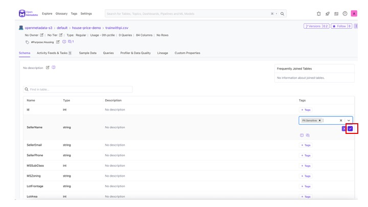

# Fybrik Based Housing Price Estimate Pipeline Sample

## Pipeline Overview

This is an enhancement of the pipeline for [house price prediction](https://github.com/kubeflow/pipelines/tree/master/samples/contrib/versioned-pipeline-ci-samples/kaggle-ci-sample).  We show how by integrating with [Fybrik](https://fybrik.io/v1.3/) the same pipeline benefits from transparent handling of non-functional requirements related to the reading and writing of data, such as the handling of credentials, automatic enforcement of data governance, and automatic allocation and cataloging of the new dataset containing the results.

Please note that data is read/written via the arrow-flight protocol in this example.

A more detailed explanation of the goals, architecture, and demo screen shots can be found [here](https://drive.google.com/file/d/1xn7pGe5pEAEZxnIzDdom9r7K6s78alcP/view?usp=sharing).

## Prerequisits

* [get_data_endpoints prerequisits and setup](../../get_data_endpoints/README.md)

## Usage

The sample provided assumes that you have put the [training](./data/trainwithpi.csv) and [testing](./data/testwithpi.csv) data sets in some type of data store, for which you have the endpoint and credentials.  The data will be read via arrow-flight protocol.

This example also assumes that Fybrik is configured to use [OpenMetadata](https://open-metadata.org/) as a data catalog, and OPA is configured as Fybrik's data governance policy manager.  These are the defaults in [Fybrik's quick start](https://fybrik.io/v1.3/get-started/quickstart/)

### Prepare Data Assets and Storage

Register in the Data Catalog (Open Metadata) the training and testing data to be used by the pipeline, noting the catalog ID of each.  Follow the instructions describing [how to register datasets in OpenMetadata](https://fybrik.io/dev/tasks/omd-discover-s3-asset/).

Add a tag Purpose.Housing and assign to both datasets.  

First define the new purpose in the list of available tags
1. Define a new purpose called `Housing` by choosing `Add Tag`, typing in the tag name, and pressing save.
   <br><center></center>
1. The new purpose will appear in the purpose list as follows
<br><center></center>

Now add the `Purpose.Housing` tag to our two datasets.  We'll start with the test asset.
1. Choose the test asset and click on `add tag` 
<br><center></center>
1. Choose Purpose.Housing from the drop down menu
<br><center></center>
1. Click on the checkmark to add the tag
<br><center></center>
1. Do the same steps for the training dataset.

Now we'll add `PII.Sensitive` tags to the relevant columns in both datasets.  This tag is pre-defined in the OpenMetadata deployment, so there is no need to create it.
1. Click on the `add tag` button next to the column SellerName and choose `PII.Sensitive` from the menu
<br><center></center>
1. Click on the checkmark to add the tag to the column
<br><center></center>

Do the same for the SellerPhone and SellerEmail columns.  The result should be as follows for the training dataset
<br><center></center>

and as follows for the test data set.
<br><center></center>

### Register Governance Policies

Run the following commands to register the data governance policies in the [OPA governance engine being used by Fybrik](https://fybrik.io/v1.0/tasks/using-opa/):

The read policy dictates that columns marked as having personal information should be redacted.

Read Policy:

```bash
kubectl -n fybrik-system create configmap pii-read-policy --from-file=data/pii-read-policy.rego
  
kubectl -n fybrik-system label configmap pii-read-policy openpolicyagent.org/policy=rego
  
while [[ $(kubectl get cm pii-read-policy -n fybrik-system -o 'jsonpath={.metadata.annotations.openpolicyagent\.org/policy-status}') != '{"status":"ok"}' ]]; do echo "waiting for policy to be applied" && sleep 5; done
```

The write policy allows all data to be written to any location registered with Fybrik as per the [prequisits](../../get_data_endpoints/README.md).

Write Policy:

```bash
kubectl -n fybrik-system create configmap allow-write-policy --from-file=data/allow-write-policy.rego
  
kubectl -n fybrik-system label configmap allow-write-policy openpolicyagent.org/policy=rego
  
while [[ $(kubectl get cm allow-write-policy -n fybrik-system -o 'jsonpath={.metadata.annotations.openpolicyagent\.org/policy-status}') != '{"status":"ok"}' ]]; do echo "waiting for policy to be applied" && sleep 5; done

```

### Upload Pipeline

Upload either the pipeline-argo.yaml or pipeline-tekton.yaml file via the Kubeflow Pipeline GUI, depending whether you installed kubeflow pipelines with Argo (default) or with Tekton Pipelines.

<br><center></center>

### Run the Pipeline

Create a pipeline run via the Kubeflow Pipeline GUI.

<br><center></center>


Provide the asset IDs of the test and train datasets from OpenMetadata.  The asset IDs are the URL without the prefix.  Prefix example: `http://localhost:8585/table`

Asset IDs as per the parameters we provided in the previous screen shots were:
* openmetadata-s3.default.house-price-demo."testwithpi.csv"
* openmetadata-s3.default.house-price-demo."trainwithpi.csv"

The following image shows where to find the asset ID in the OpenMetadata GUI

<br><center></center>

After entering the test and training asset IDs, submit the run.
<br><center></center>


### View Pipeline Run Details

Click on each step in the Kubeflow Pipeline GUI and view its log to see the output.  

* get-data-endpoints prints and returns the virtual endpoints for the 3 dataset (test, train, results)
* visualize-table prints a preview of the data, and you can see that the personal information has been obfuscated
* train-model runs trains the machine learning model and then runs it on the test data, printing out a sample of the results
* submit-result prints out the data catalog asset ID of the newly created asset containing the results

See slides 21-24 of the [demo presentation](https://drive.google.com/file/d/1xn7pGe5pEAEZxnIzDdom9r7K6s78alcP/view?usp=sharing) for the intermediate steps.

The final state with submit-result step results will appear as follows:
<br><center></center>

After the run is complete you can go to the catalog and see the new catalog entry, and in your storage you can see the newly created result data.


### Making Changes to the Pipeline

If you want to experiment with changing the pipeline, you will need [Kubeflow Pipelines SDK](https://www.kubeflow.org/docs/components/pipelines/sdk/install-sdk/) and its prerequisits.  Among the prerequisits you will need pip3 and the kfp library.  

[pipenv](https://pypi.org/project/pipenv/) is also very helpful, but not required, since it assumes nothing about your pre-installed python libraries, and creates a brand new python environment without affecting other python installation you may have in your environment.

After making changes in either pipeline-argo.py or pipeline-tekton.py, compile the pipeline as follows:

If your kubeflow pipeline deployment uses Argo Workflows (the default):

```bash
python3 pipeline-argo.py
```

This will result in a file called pipeline-argo.yaml.

If you deployed kubeflow pipeline with tekton as the workflow manager:

```bash
python3 pipeline-tekton.py
```

This will result in a file called pipeline-tekton.yaml.
